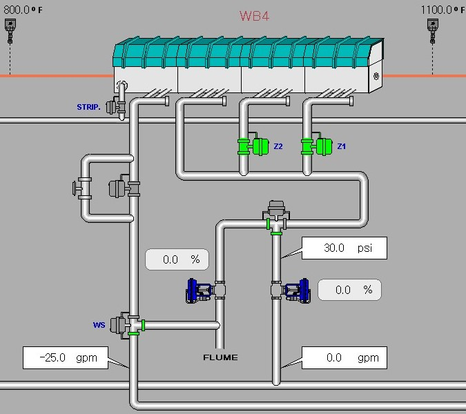

# Effects of Waterbox utilization
In completion of the requirements for M.S. Data Science, Data Engineering emphasis I present a review of waterbox utilization, and use of machine learning to generate recommendations for future manufacturing set up.

# Background
Steel mills use waterboxes to control product temperatures during manufacturing.

Steel Mill Characteristics

I currently work at a steel mill which produces steel wire rod. The product is sold in 5000 lb packages, in a coils configuration. Rod diameters range from 7/32" to 3/4" diameter. Multiple grades (chemistries) are produced to meet a variety of end use applications. 

 What is a Waterbox?

A waterbox is component used to cool wire rod during manufacture. After hot steel rod is rolled to final size, it is cooled to a target temperature to assist in meeting final mechanical properties. The rod flows through a waterbox at high speed, and is subjected to a continuous flow of water at pressure. 

How are Waterboxes used?

At the subject steel mill, there are five waterboxes which may be used in multiple configurations to achieve final temperature. There are multiple settings for each waterbox which can be adjusted to affect the product. This includes flow rates and pressures. There are three different bore diameters in the cooling nozzles which also affect the relationship between the water flow rate and pressure. For each box there are three zones which can be turned on and off, further changing the water's contact length to the product. 

# Research Problem
To achieve desired final temperatures, operators can set values for many factors affecting the waterbox performance. The selection of these parameter values is currently a judgement call by the operators. By using machine learning on historical data, I want to develop a model which can set guildline values for the operators to use in future practices. 

# Available data
A data historian is currently used at the Rod mill which captures 3k+ signals from sensors at a poll rate of 16 ms. For the waterboxes, water flow rates, pressures and resulting surface temperatures are all recorded. Several categorical variables representing product descriptors are also available including grades, diameters, and desired final temperature. 

Millisecond data for continuous variables have been aggregated using industrial tools and saved to a SQL database. Aggregation frequency is grouped to each coil produced. 

This data has been sanitized of confidential information.

# Project Results
The project was successful, and the full analysis is in [Full analysis](data_extraction.ipynb). I was able to extract and clean data from multiple data sources. While reviewing the data, factors were selected and records filtered to provide a set of data which could produce meaningful insights. Representative models were created using linear regression and support vector regression. A "best" model was picked and reviewed for optimum future parameter selection. Overall, the goals of the project were met.

In the future this work could be extended by incorporating more physical parameters, and shifting focus to mechanical properties instead of the selected process temperature. The use of a better flow and pressure, possibly with some randomization of speed and incoming temperature may better illustrate a more natural response to temperatures. 
